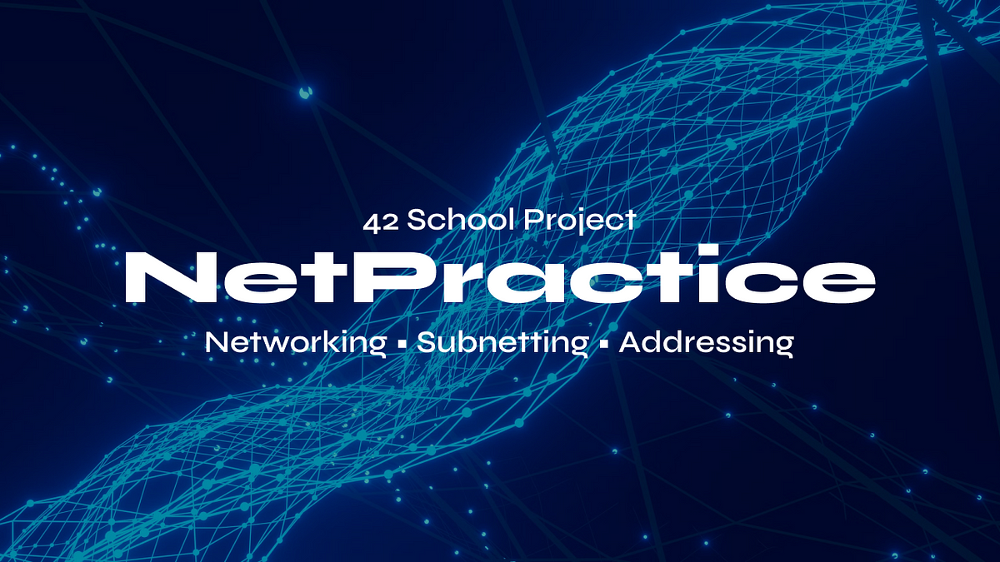

# Net_Practice



NetPractice is a web-based application designed to help users practice and improve their networking skills. Whether you're a beginner learning the basics of networking or an experienced professional looking to refine your skills, NetPractice provides a platform for hands-on learning and experimentation.

#### NOTE:
If you wanna practice more : https://subnetipv4.com/

## Levels

<details>
  <summary>Level 1</summary>
  <br>
    
  <br>

**1.** Since _Client A_ and _Client B_ are on the same network, their IP address must represent the same network in accordance with the subnet mask.
<br>
The subnet mask is _255.255.255.0_, which means that the first 3 bytes of the IP address represent the network, and the 4th byte represents the host. Since we are on the same network, only the host can change.
<br>
The solution will be anything in the range of **104.99.23.0 - 104.99.23.255** excluding the following 3:

- **104.99.23.0:** The first number in the range of hosts (0 in this case) represents the network and cannot be used by a host.
- **104.99.23.255:** The last number in the range of hosts (255 in this case) represents the broadcast address.
- **104.99.23.12:** This address is already used by the host _Client B_.

**2.** The same reasoning as _1._, however the subnet mask is _255.255.0.0_ in this case. The first 2 bytes of the IP address will represent the network; and the last 2 bytes, the host address.
<br>
The solution will be anything in the range of **211.191.0.0 - 211.191.255.255**, excluding:

- **211.191.0.0:** Represents the network address.
- **211.191.255.255:** Represents the broadcast address.
- **211.191.89.75:** Already taken by host _Client C_.

</br>

</details>

---

<details>
  <summary>Level 2</summary>
  <br>
  
  <br>

**1.** Since _Client B_ is on the same private network as _Client A_, they should have the exact same subnet mask.
<br>
The solution can only be **255.255.255.224**.

**2.** To understand the subnet mask of _255.255.255.224_, let's look at it in binary form, along with the IP _192.168.34.222_ of _Client B_:

<center>

```
MASK: 11111111.11111111.11111111.11100000
IP:   11000000.10101000.00010100.11011101
```

</center>
As we can see, the first 27 bits represent the IP address, while only the last 5 bits represent the host address.
<br>
All these 27 bits representing the network must stay the same in the IP addresses of hosts on the same network. To get the answer, we can only change the last 5 bits.
<br>
<br>
The answer is in the range of:

```
BIN:  11000000.10101000.00100010.11000000 - 11000000.10101000.00100010.11011111
or
DEC:  192.168.34.192 - 192.168.34.223
```

Excluding:
<br>

- **11000000.10101000.00100010.11000000:** Represents the network address (notice all 0 in the last 5 bits).
- **11000000.10101000.00100010.11011111:** Represents the broadcast address (notice all 1 in the last 5 bits).
- **11000000.10101000.00100010.11011110:** _Client B_ already has that address.

**3.** Here we are introduced the slash "/" notation for the subnet mask on _Interface D1_. A subnet mask of _/30_ means that the first 30 bits of the IP address represent the network address, and the remaining 2 bits represent the host address:

<center>

```
Mask /30: 11111111.11111111.11111111.11111100
```

</center>

We can see that this binary number corresponds to the decimal _255.255.255.252_, therefore it is identical to the mask found on _Interface C1_.
<br>
<br>
The answers can then be any address, as long as they meet the following conditions:

- The network address (first 30 bits) must be identical for _Client D_ and _Client C_.
- The host bits (last 2 bits) cannot be all 1, nor all 0.
- _Client D_ and _Client C_ do not have identical IP addresses.

</br>

</details>

---
<details>
  <summary>Level 3</summary>
  <br>
  
  <br>
  <br>

This exercise introduces the use of the **switch** (_Switch S_ in this example). The switch links multiple hosts of the same network together.
<br>
<br>

**1.** _Client A_, _Client B_, and _Client C_ are all on the same network. Therefore, they must all have the same subnet mask. Since _Client C_ already has the mask _255.255.255.128_, the mask for _Interface B1_ and for _Interface A1_ will also be _255.255.255.128_ (or in slash notation: _/25_).
<br>
<br>
The IP address of _Interface B1_ and _Interface C1_ must be on the same network range as the IP of _Client A_. This range is:

  <center>

```
104.198.189.0 - 104.198.189.128
```

  </center>
  Excluding of course the network address and the broadcast address.

</br>

</details>

---

<details>
  <summary>Level 4</summary>
  <br>
  
  <br>
  <br>

This exercise introduces the **router**. The router is used to link multiple networks together. It does so with the use of multiple interfaces (_Interface R1_, _Interface R2_, and _Interface R3_ in this example).
<br>
<br>

**1.** Since none of the masks on _Interface B1_, _Interface A1_, and _Interface R1_ are entered, we are free to choose our own subnet mask. A mask of **/28** is ideal as it leaves us with the entire 4th byte for the host address, and does not require binary calculations to find the range of possible host addresses.
<br>
<br>
The IP address of _Interface B1_ and _Interface R1_ must have the same network address as the IP address of _Interface A1_. With a subnet of _/28_, the possible range is:

  <center>

```
91.181.112.128 - 91.181.112.143
```

  </center>
  Excluding the network address and the broadcast address.
  <br>
  <br>

Note that we did not interact with the router _Interface R2_ and _Interface R3_, since none of our communications had to reach these sides of the router.
</br>

</details>

---

<details>
  <summary>Level 5</summary>
  <br>
  
  <br>
</details>

---

<details>
  <summary>Level 6</summary>
  <br>
  
  <br>
</details>

---

<details>
  <summary>Level 7</summary>
  <br>
  
  <br>
  
</details>

---

<details>
  <summary>Level 8</summary>
  <br>
  
  <br>
</details>

---

<details>
  <summary>Level 9</summary>
  <br>
  
  <br>
  <br>

This level is quite straightforward since the internet does not initially send its packets to a specific network. Therefore, the separate networks do not need to share a common address range. I would suggest simply following the 6 goals of the level one by one until the level is completed.
<br>
<br>
Remember not to use the network addresses from the reserved private IP ranges.
<br>
<br>

**1.** **Goal 3** states that we must connect _meson_ with the _internet_. The _internet_ will then have to respond to _meson_, so we enter _meson's_ network address in the _internet's_ destination.
<br>
<br>
**Goal 6** states that we must connect _cation_ with the _internet_, so we enter _cation's_ network address in the _internet's_ destination.
<br>
<br>
It is normal to have an empty field for the 3rd destination of the _internet_, and in _Router R1's_ destination. Not all fields of the routing tables need to be filled.

</br>

</details>

---

<details>
  <summary>Level 10</summary>
  <br>
  
  <br>

</details>

